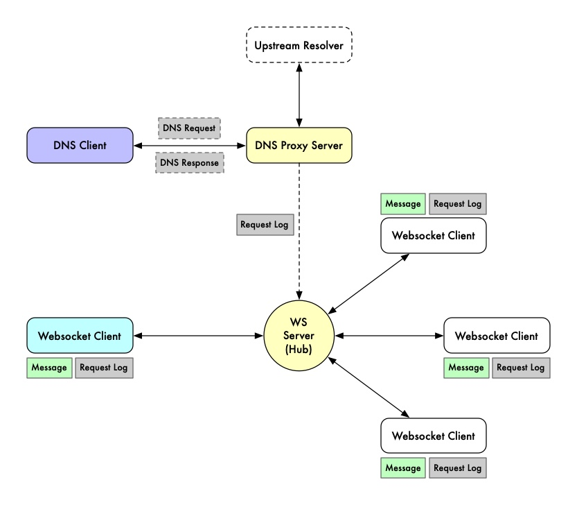

# DNS And Websocket For Fun

A toy server that acts as a DNS proxy and HTTP server (including WebSocket server).

## Overview

  

- DNS request log will be broadcasted to all connected WebSocket clients. To demonstrate server-initiated events.
- It also receives an incoming free text message from the WebSocket client and the WebSocket hub will broadcast those
  messages to all connected WebSocket clients. To demonstrate client-initiated events.
- The internal mechanism for passing data between goroutine is using go-channel. 
- Implements [`share memory by communicating`](http://go-proverbs.github.io/).

**_NOTE: this repository is a sample for the Golang sharing session showcase, mainly to cover WebSocket and concurrent
programming (using goroutine and channel)._**

## Build And Execute

### Requirement

- Go >= v1.16

### Build

All dependencies are included in `vendor` folder (`go mod tidy && go mod vendor`), so you can just clone this repo and
then:

- `go build -trimpath -a -mod=vendor -tags "osusergo,netgo" -ldflags '-w -s -v' -o ./build/server ./main.go`

### Execute

- `./build/server`

For available arguments, use `./build/server -h`.

## Demo

- Open `http://127.0.0.1:8080` to see the web page, it will open new WebSocket session from the web browser.
- Point your DNS resolver to `127.0.0.1` port `53` Or simple test using `dig` command, for example: `dig MX simukti.net @127.0.0.1`.

To simulate another WebSocket client connected, you can use one of these tools to connect to the WebSocket server at `ws://127.0.0.1:8080/ws`:

- [WebSocket King Client (Chrome extension)](https://chrome.google.com/webstore/detail/websocket-king-client/cbcbkhdmedgianpaifchdaddpnmgnknn?hl=en)
- [Weasel (Firefox extension)](https://addons.mozilla.org/en-US/firefox/addon/websocket-weasel/)
- [Websocat CLI](https://github.com/vi/websocat)

## LICENSE

MIT